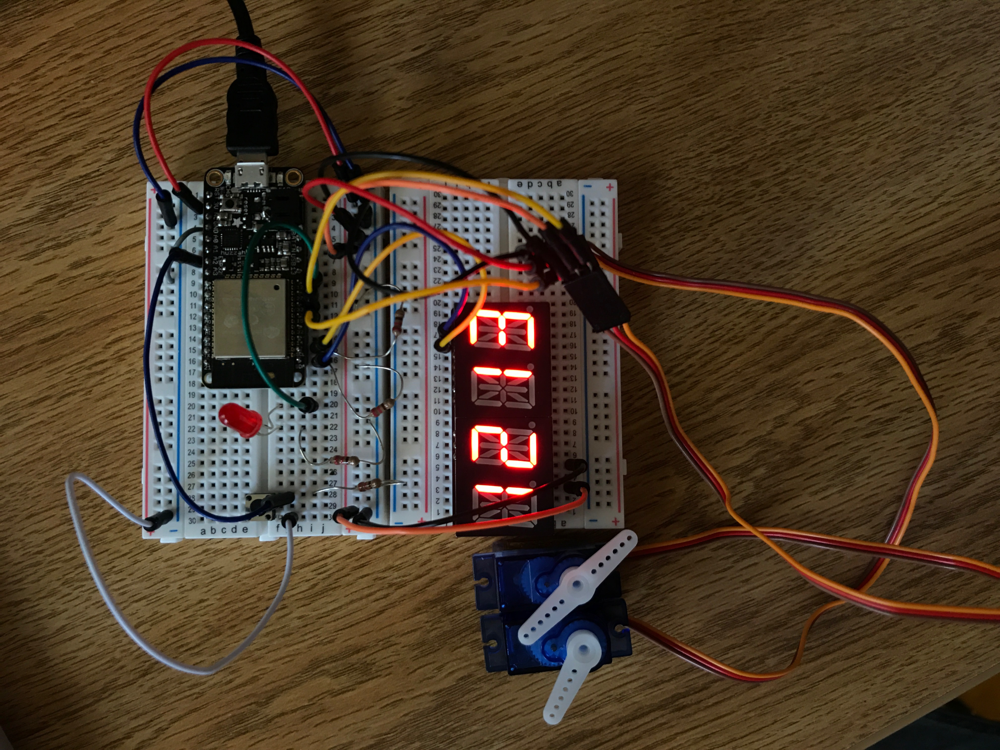
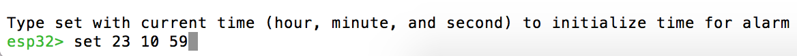
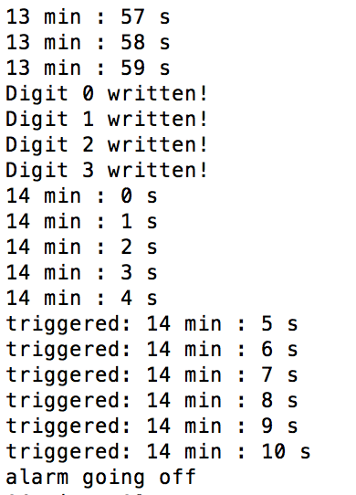

# Pseudo-mechanical clock
Author: Ellen Lo, 2019-09-18

## Summary
I designed an alarm clock which has the following hardware functionalities:
- pushbutton to restart alarm
- LED to alert alarm going off
- numerical display to show current time (hour and minute)
- servos as second hand and minute hand to show current time

## Implementation
The program keeps track of current time with 3 variables (*hour_count* and *minute_count* and *second_count*). It sets minute hand every minute and second hand every second via 2 servos respectively and updates time displayed on the alphanumerical display every minute. Timer 0 of timer group 1 (aka second timer) goes off every second to update *second_count* variable. Conditional statements are used to reset the 3 time tracking variables when they hit its maximum value - 23 for *hour_count*, and 59 for both *minute_count* and *second_count*.

To restart alarm, user presses pushbutton and hence setting the reset flag. Once reset flag is set, timer 0 of timer group 0 (which goes off at preset alarming period) starts counting.  As servo range is 180 degrees, each second tick increments servo angle by 3 degrees until hitting 60 second limit. Once the time hits 60 seconds, minute hand increments by 3 degrees and second hand returns to its zero position. When time hits preset alarm interval, red LED blinks, reset flag is reset, and the program simply waits for user to start alarm again.

I created a modular program for alphanumerical display before for the corresponding skill, so I'm reusing it with slight modification to simplify the main code. Functions are declared in AlphaDisplay.c.

## Sketches and Photos
### Wiring

- LED: positive terminal connected to gpio #12, negative to ground via resistor
- pushbutton: one end connected to power via resistor and also gpi #34
- servos: positive to power, negative to ground, pwm to gpio #15 and #33 respectively
- alphanumeric display: esp32's sda(#23) to display's sda(#27) and scl(#22) to scl(#26) with the addition of pullup resistors for both data and clock signal channels 

### Console

Prompts for user to initialize time at startup. 

For every second, console will show current time in minute and second for debugging purposes. If console output shows word "triggered" in front of time, it means that pushbutton is pressed and timer 0 of group 0 (alarm) is started. Line "alarm going off" will show when alarm time is up. In addition, "Digit (x) written!" statements show every minute, as a sign to notify update of alphanumeric display.

## Modules, Tools, Source Used in Solution
-[my modular program for alphanumeric display](https://github.com/BU-EC444/Lo-Ellen/tree/master/skills/3-sensor-actuator/Code/alpha-display)

## Supporting Artifacts
-[Video Demo](https://youtu.be/CzaMl4gHX_E)
