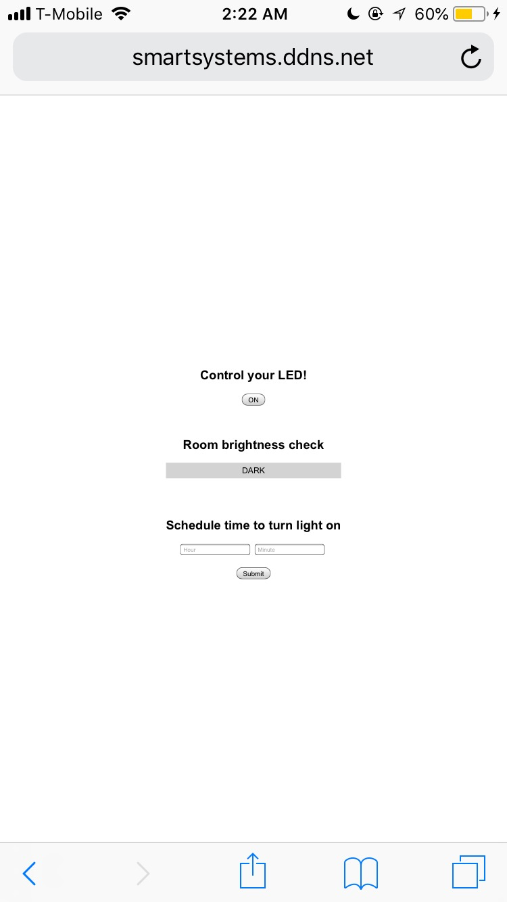
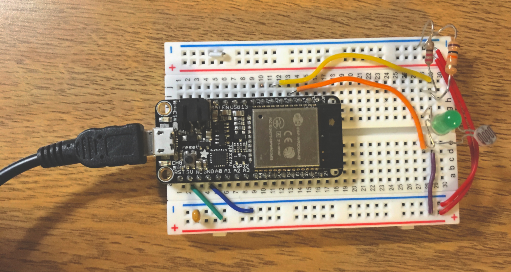
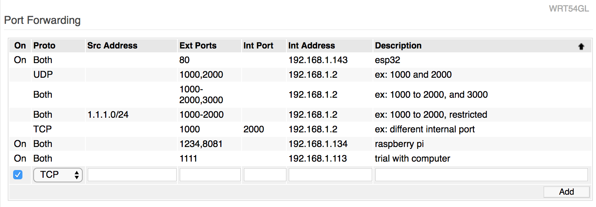

# Online appliance
Author: Ellen Lo, 2018-10-27

## Summary
In this quest, I created a online appliance which can control LED and monitor room brightness remotely via web client. There are 3 main components in this quest: web client, main server on Pi or Mac, and ESP32. I also managed to stream webcam content via a remote web client.

## How to run
Given that server port is 1111 and esp32 port is 80,

1. to start node server, run `node server.js` under *mac-server* folder
2. to start python client, run `python2 client.py smartsystems.ddns.net 80 1111` under *httpd-client* folder
3. to run httpd server on ESP32, run `make flash` under *httpd-server* folder
4. to control LED and monitor room brightness, browse `http://smartsystems.ddns.net:1111/`

To start separate webcam stream, ssh into raspberry pi, run `sudo service motion start`, and browse `http://smartsystems.ddns.net:8081`

## Implementation
There are two programs (*httpd-client/client.py* and *mac_server/server.js*) running on the main machine. The former *client.py* communicates with httpd server on esp32, and the latter *server.js* communicates with web client. There is also communication between middle client and middle server on the machine via GET and POST requests.

On the web client interface (under *mac_server/public/toggle.js*), there is a toggle button as well as text showing room brightness. It makes POST request to main server on button click to notify button state change, and makes GET request to main server every half second for room brightness updates.

On ESP32 (under *httpd-server* folder), there are two handlers to respond to GET and PUT requests from main server. The PUT request turns on and off LED based on the received input from middle server, and the program sends room brightness state when middle client makes GET request.

The webcam streaming component is simple. I followed the instructions on this [guide](https://pimylifeup.com/raspberry-pi-webcam-server/) as described in the writeup of the webcam skill. I also added 8081 to be the forwarded port of pi's IP so I can view content on `http://smartsystems.ddns.net:8081` on a separate machine from the pi.

## Sketches and Photos
### Mobile client interface

### Wiring

LED is connected to GPIO 32 and light diode is connected to GPIO 33.

### Forwarded ports for different devices

## Modules, Tools, Source Used in Solution
-[Build a Raspberry Pi Webcam Server in Minutes](https://pimylifeup.com/raspberry-pi-webcam-server/)
-[esp-idf simple httpd server example](https://github.com/espressif/esp-idf/tree/affe75a10250564353d088f6b9a74dbb6f1ea0df/examples/protocols/http_server/simple)
-[Node.JS Express example](http://theusualstuff.com/handle-form-data-express-get-post-method/  )

## Supporting Artifacts
-[Video Demo](https://youtu.be/zBvRYD-A7gQ)
